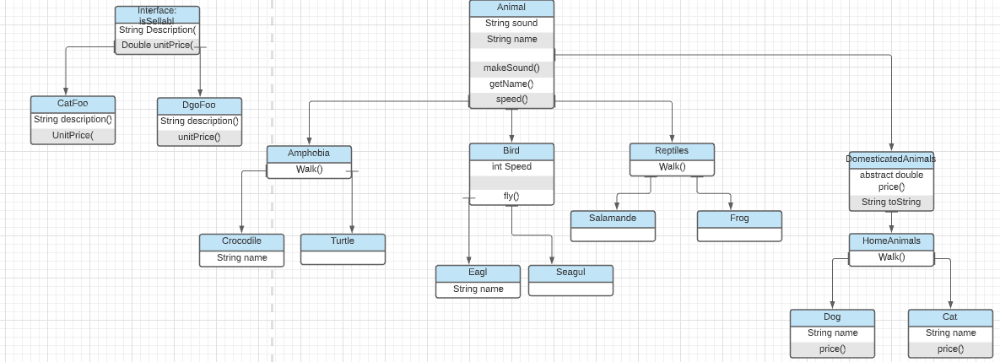
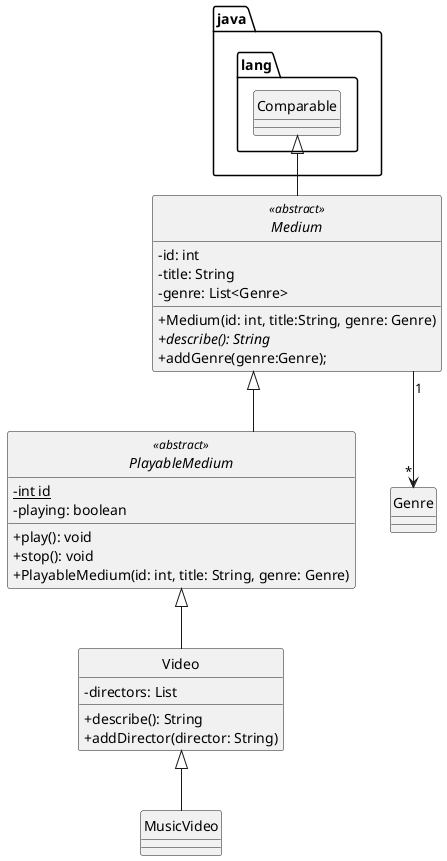

!!! BELANGRIJK: Gitlab is voor mij bugged dus heb mijn project op mijn eigen github gepushed.
link: https://github.com/Jeffrey1998/HVA-OOP-animals/tree/master/out/production/Animal-OOP-eindopdracht/com/company

Voornaam: Jeffrey

Achternaam: van de Beek

Studentnummer: 500889236

### Inleiding

Het doel van de applicatie is dat er dieren zoals: hond, kat die onder de subclass huisdieren vallen.
Daarbij komen nog een paar dier soorten om de hoek kijken. Deze dieren hebben een apparte aanroep, op deze manier als 
je dat aanroept maakt ieder dier zijn eigen geluid. Het uiteindelijke doel van deze applicatie is dat ik laat zien 
dat ik het concept van OOP begrijp en dit aan de docent kan laten zien d.m.v. mijn applicatie.

### UML class diagram

Vervang de tekst onder deze header met een link naar je uml-class-diagram plaatje. Hieronder een voorbeeld hoe je in markdown naar een plaatje kan linken:

```markdown
  
```



### Voorwaarden programma

#### OOP1

##### 1. Het commando `git log --pretty=format:"%hx %ad%x09%s" --date=short` bevat inzichtelijke atomaire commits op.

```
Plaats hier het resultaat van git log --pretty=format:"%hx %ad%x09%s" --date=short`
```

Bewijs:  [linknaarhetbronbestandinjerepo](https://gitlab.fdmci.hva.nl/repo-van-jou)

##### 2. Abstract class 'A' correct geïmplementeerd

```java
Plaats hier je code snippets
```

Bewijs:  [linknaarhetbronbestandinjerepo](https://gitlab.fdmci.hva.nl/repo-van-jou)

##### 3. Subclass implementeert abstract class

```
Plaats hier je code snippets
```

Bewijs:  [linknaarhetbronbestandinjerepo](https://gitlab.fdmci.hva.nl/repo-van-jou)

##### 4. Interface correct geïmplementeerd.

```java
Plaats hier je code snippets
```

Bewijs:  [linknaarhetbronbestandinjerepo](https://gitlab.fdmci.hva.nl/repo-van-jou)

##### 5. Er is een klasse aanwezig met minimaal twee constructors 

```java
Plaats hier je code snippets
```

Bewijs:  [linknaarhetbronbestandinjerepo](https://gitlab.fdmci.hva.nl/repo-van-jou)

##### 6. `super` key gebruikt voor aanroep constructor

```java
Plaats hier je code snippets
```

Bewijs:  [linknaarhetbronbestandinjerepo](https://gitlab.fdmci.hva.nl/repo-van-jou)

##### 7. `super` key gebruikt voor aanroep methode

```java
Plaats hier je code snippets
```

Bewijs:  [linknaarhetbronbestandinjerepo](https://gitlab.fdmci.hva.nl/repo-van-jou)

##### 8. `instanceof` aangetoond

```java
Plaats hier je code snippets
```

Bewijs:  [linknaarhetbronbestandinjerepo](https://gitlab.fdmci.hva.nl/repo-van-jou)

##### 9. cast gebruikt voor gebruik van classe-specifieke methodes

```java
Plaats hier je code snippets
```

Bewijs:  [linknaarhetbronbestandinjerepo](https://gitlab.fdmci.hva.nl/repo-van-jou)

##### 10. Er is testcode aanwezig om de punten hierboven te demonstreren. (Als je ook OOP2 doet: gebruik testcode-voorwaarden van OOP2)

```java
Plaats hier je code snippets
```

Bewijs:  [linknaarhetbronbestandinjerepo]

##### 11. Classes en methodes zijn voldoen aan HBO-ICT coding standards

```
Plaats hier je meest ingewikkelde stukje code met javadoc, en normaal commentaar  
```

Bewijs:  [linknaarhetbronbestandinjerepo](https://gitlab.fdmci.hva.nl/repo-van-jou)

#### OOP2

Naast de OOP1 voorwaarden dient je OOP2 programma aan de volgende voorwaarden te voldoen:

##### 1. Gebruikt en implementeert minimaal 2 functionele interfaces uit de package `java.util.function`
```java
Plaats hier je code snippets
```

Bewijs:  [linknaarhetbronbestandinjerepo](https://gitlab.fdmci.hva.nl/repo-van-jou)

##### 2. Een classe met 2 endpoints (d.m.v. Javalin framework)

   1. GET request waarbij er data uit een tekstbestand wordt gelezen en terug gestuurd.
   2. POST request waarbij er data wordt weggeschreven naar een tekstbestand.
```java
Plaats hier je code snippets voor GET request
```

Bewijs:  [linknaarhetbronbestandinjerepo](https://gitlab.fdmci.hva.nl/repo-van-jou)

```java
Plaats hier je code snippets voor POST request
```

Bewijs:  [linknaarhetbronbestandinjerepo]

##### 3. Een custom Exception "E" gedefiniëerd.

```
Plaats hier je code snippets
```

Bewijs:  [linknaarhetbronbestandinjerepo](https://gitlab.fdmci.hva.nl/repo-van-jou)

##### 4. Custom Exception "E" wordt gebruikt via een `throws` constructie.

```
Plaats hier je code snippets
```

Bewijs:  [linknaarhetbronbestandinjerepo](https://gitlab.fdmci.hva.nl/repo-van-jou)

##### 5. Custom Exception "E" wordt gebruikt via een `catch` constructie

```
Plaats hier je code snippets
```

Bewijs:  [linknaarhetbronbestandinjerepo](https://gitlab.fdmci.hva.nl/repo-van-jou)

##### 6. Minimaal 1 `intermediate operation` op een stream

```
Plaats hier je code snippets
```

Bewijs:  [linknaarhetbronbestandinjerepo](https://gitlab.fdmci.hva.nl/repo-van-jou)

##### 7. Minimaal 1 `terminal operation` op een stream

```
Plaats hier je code snippets
```

Bewijs:  [linknaarhetbronbestandinjerepo](https://gitlab.fdmci.hva.nl/repo-van-jou)

##### 8. Testcode met 100% code coverage

```
Plaats hier je code snippets
```

Bewijs:  [linknaarhetbronbestandinjerepo](https://gitlab.fdmci.hva.nl/repo-van-jou)

